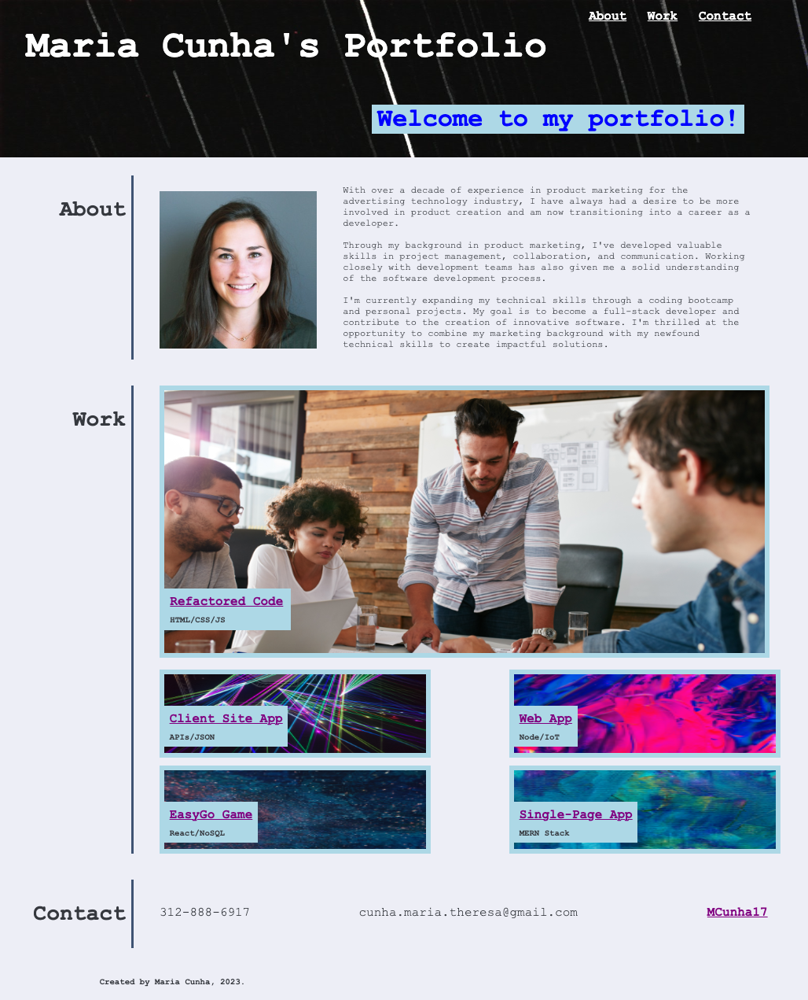

# Maria Cunha Development Portfolio
## Description

My professional portfolio to showcase development work.

This is the beginning of my own developmental portfolio, which I plan to continue to expand upon as I practice and improve my coding skills.

At this time, the only project shared in this portfolio is a site refactor I completed for a marketing agency in order to make the site more accessible. The remaining links are placeholders (they currently go to my GitHub site) until I have real projects to replace them with.

When creating this page, I had the opportunity to practice my CSS skills. Specifically with creating flex boxes and adjusting positioning, padding, and margin so that the site was responsive.

## Screenshot

Here is a screenshot of the published portfolio, which you can access <a href="https://mcunha17.github.io/maria-cunha-portfolio/">here</a>.

## Credits

Primary Image: The primary image came from my <a href="https://github.com/MCunha17/accessibility-site-refactor">Accessibility Site Refactor project</a>, which borrowed code and imagery from <a href="https://github.com/coding-boot-camp/urban-octo-telegram">Xandromus</a>.

Header and secondary (smaller) images: Obtained from <a href="https://www.pexels.com/">Pexels</a>, which provides free stock photos shared by creators.

Header image: <a href="https://www.pexels.com/photo/coding-script-965345/">Markus Spiske</a>. 
Client Site App image: <a href="https://www.pexels.com/photo/assorted-color-laser-lights-417458/">Pixabay</a>. 
Web App image: <a href="https://www.pexels.com/photo/pink-and-purple-wallpaper-1616403/">Zaksheuskaya</a>. 
EasyGo Game image: <a href="https://www.pexels.com/photo/blue-and-red-galaxy-artwork-1629236/">Suzy Hazelwood</a>. 
Single-Page app image: <a href="https://www.pexels.com/photo/multicolored-abstract-painting-1509534/">Steve Johnson</a>.

You can access the repository for my portfolio <a href="https://github.com/MCunha17/maria-cunha-portfolio">here</a>.
